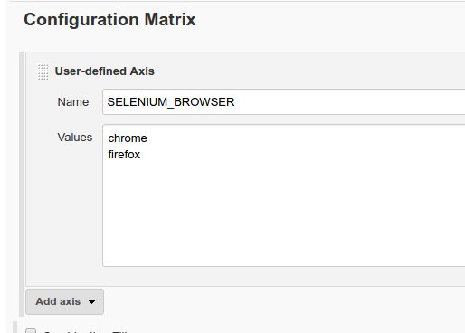
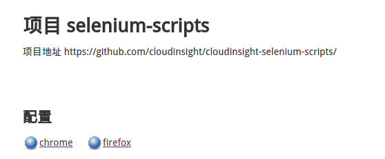

# cloudinsight-selenium-scripts

> 使用 Selenium API 快速验证 CloudInsight 左边导航栏里的所有的链接。

## 目的

- 验证以 OneAPM Demo 用户能否登录否成功
- 检查 CloudInsight 网站是否可用
- 检查是否有坏链
- 及时发现严重的 CSS，字体，图片缺失等显示错误
- 检查 CDN 的可用性

## 配置可选项

|      环境变量              |       备注       | 默认值                                  |
|---------------------------|------------------|----------------------------------------|
|   SELENIUM_BROWSER        |   浏览器(chrome,firefox,internet explorer) | firefox       |
|   SELENIUM_REMOTE_URL     |   Selenium Hub   | 本地                                    |
|   HOMEPAGE                |   首页            | https://cloud.oneapm.com/              |
|   LOGINPAGE               |   登录页          | https://user.oneapm.com/account/demo.do|

## 配合 Jenkins 的 Configuration Matrix 使用效果最佳

Jenkins 需要安装这几个插件

[`Selenium Plugin`](http://wiki.jenkins-ci.org/display/JENKINS/Selenium+Plugin)

能够自动下载和运行 `Selenium` 所需的 `Jar` 文件

[`Image Gallery Plugin`](https://wiki.jenkins-ci.org/display/JENKINS/Image+Gallery+Plugin)

能够把构建 Artifacts 里的图片显示成一个 Gallery

## 最终效果

